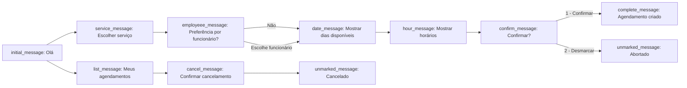

**Fluxo da State Machine**

O diagrama abaixo descreve o fluxo principal de conversa coberto pelos testes E2E.

Observações:
- Entre estados o controlador persiste `context.context_data` (ex.: `service_id`, `available_days`, `available_slots`).
- `confirm_message` revalida conflitos antes de criar o `Scheduling`. Em caso de conflito retorna para `hour_message`.

Arquivo gerado automaticamente por testes E2E.
